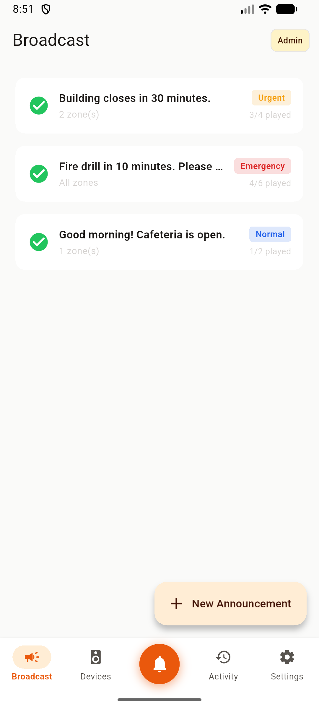
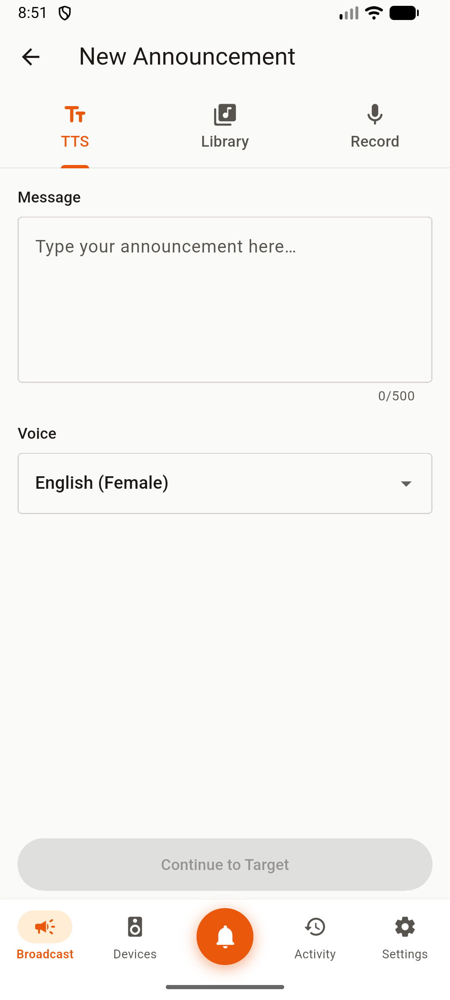
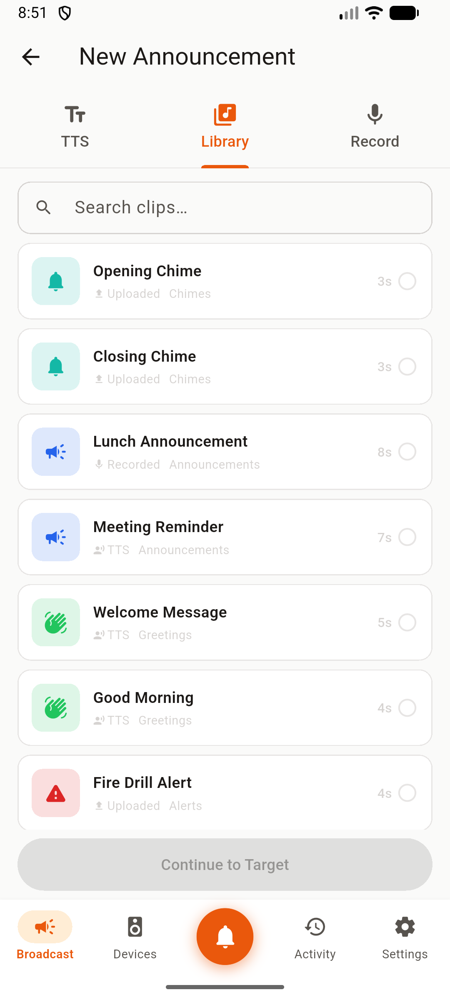
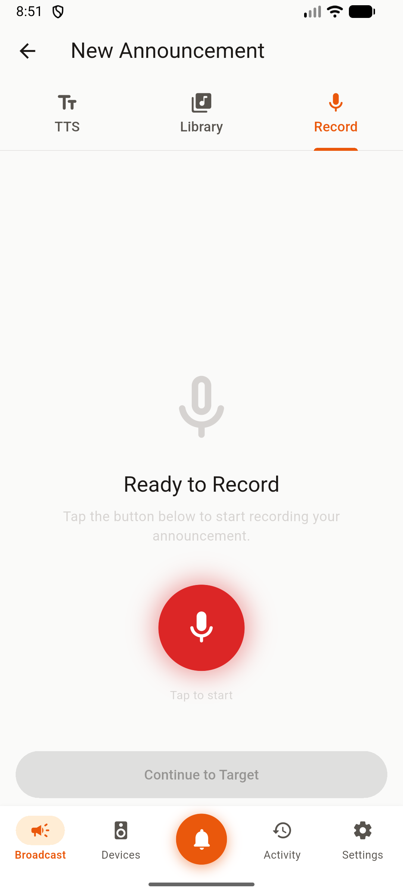
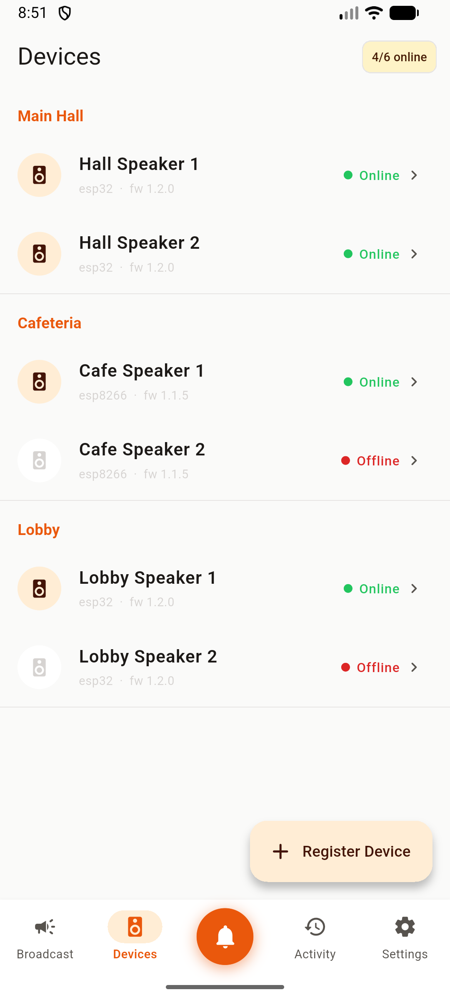
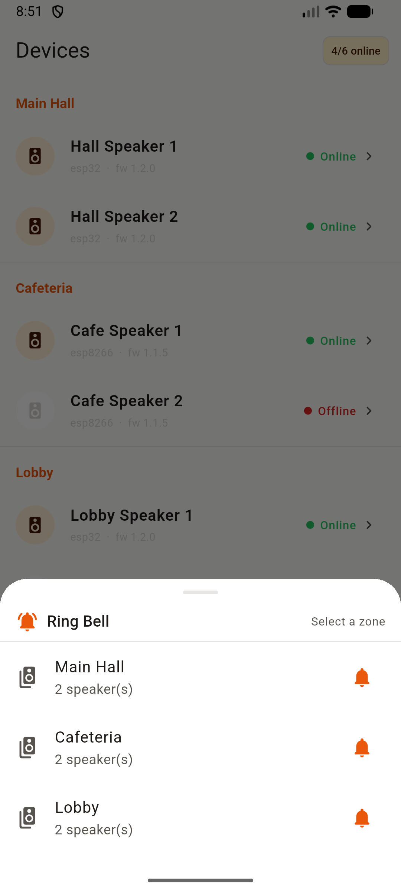
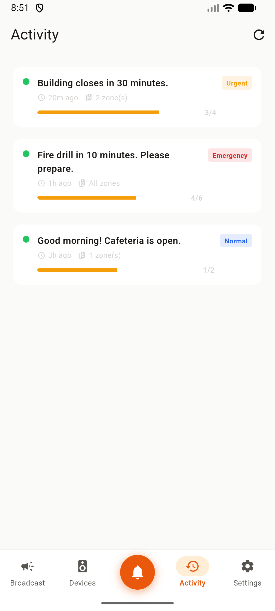
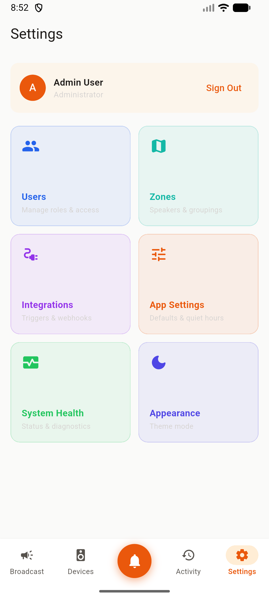

# Aakashvani

**Smart broadcasting for every corner of your organization.**

Aakashvani is a platform that lets you send voice announcements, play audio clips, and ring bells across a network of smart speakers — instantly, on a schedule, or in an emergency. Whether you're a school calling students to assembly, a factory alerting a shift change, or an office sending a company-wide update, Aakashvani puts a public address system in your pocket.

---

## Who is it for?

| Role | What they do |
|---|---|
| **Administrator** | Manage devices, zones, users, and system settings |
| **Broadcaster** | Send announcements, upload audio clips, schedule recurring broadcasts |
| **Viewer** | Monitor broadcast history and delivery status |

Aakashvani is designed for organizations that need reliable, coordinated audio — schools, factories, offices, hospitals, transit hubs, and emergency management centers.

---

## What can you do with it?

### Send announcements, your way
- **Text-to-Speech** — Type a message and it plays as a voice announcement in English, Hindi, or Marathi
- **Audio Clips** — Upload pre-recorded clips and broadcast them to any zone
- **Bell / Chime** — Ring a bell across all devices with a single tap
- **Priority levels** — Mark broadcasts as Normal, Urgent, or Emergency to cut through the noise

### Know it was heard
- Real-time delivery tracking — see which devices played your announcement, which are still pending, and which failed
- Live device status board — know at a glance which speakers are online, offline, or currently playing

### Never miss a recurring moment
- Schedule broadcasts to repeat daily, on weekdays, weekly, or monthly
- Calendar view to review and manage upcoming broadcasts
- Quiet hours configuration so scheduled broadcasts never play at the wrong time

### Manage your speaker network
- Group speakers into zones (e.g., "Classrooms", "Cafeteria", "Shop Floor")
- Monitor device health and connectivity via heartbeat
- Over-the-air firmware updates for deployed speakers

---

## Screenshots

<table>
  <tr>
    <td align="center">
      <br/>
      <sub><b>Broadcast List</b><br/>All broadcasts with priority badges</sub>
    </td>
    <td align="center">
      <br/>
      <sub><b>New Announcement</b><br/>Type-to-speech with voice selection</sub>
    </td>
    <td align="center">
      <br/>
      <sub><b>Audio Library</b><br/>Browse and pick pre-recorded clips</sub>
    </td>
    <td align="center">
      <br/>
      <sub><b>Record</b><br/>Record a live announcement in-app</sub>
    </td>
  </tr>
  <tr>
    <td align="center">
      <br/>
      <sub><b>Devices</b><br/>Speakers grouped by zone with live status</sub>
    </td>
    <td align="center">
      <br/>
      <sub><b>Ring Bell</b><br/>Instant chime to any zone</sub>
    </td>
    <td align="center">
      <br/>
      <sub><b>Activity</b><br/>Delivery progress per broadcast</sub>
    </td>
    <td align="center">
      <br/>
      <sub><b>Settings</b><br/>Admin panel: users, zones, integrations</sub>
    </td>
  </tr>
</table>

---

## How it works

Aakashvani has three components that work together:

```
[ Flutter Mobile App ]
        |
        | REST API + WebSocket
        v
[ Django Backend ]  <---->  [ Redis + Celery ]
        |
        | HTTP polling
        v
[ Raspberry Pi Speakers ]
```

1. **Mobile App** — Broadcasters and admins use the Flutter app (iOS/Android) to send and manage announcements
2. **Backend** — A Django REST API handles authentication, broadcast logic, scheduling, and real-time status via WebSocket
3. **Device Listener** — A lightweight Python daemon runs on each Raspberry Pi speaker, polls for assigned broadcasts, and plays them using TTS (espeak-ng) or audio clips (FFmpeg)

---

## Getting Started

### Prerequisites

- [Docker](https://docs.docker.com/get-docker/) and Docker Compose
- [Flutter SDK](https://flutter.dev/docs/get-started/install) (3.x+)
- Python 3.10+ (for the device listener)

### 1. Start the Backend

```bash
cd backend
docker compose up --build
```

The backend starts at `http://localhost:8000`. It auto-runs migrations and seeds demo users:

| Email | Password | Role |
|---|---|---|
| admin@aakashvani.in | password | Administrator |
| broadcaster1@aakashvani.in | password | Broadcaster |
| viewer1@aakashvani.in | password | Viewer |

API documentation is available at `http://localhost:8000/api/docs/`.

### 2. Run the Mobile App

```bash
cd app/aakashvani
flutter pub get

# Run with mock backend (no hardware needed — great for UI development)
flutter run --dart-define=USE_MOCK=true

# Run against the real backend
flutter run \
  --dart-define=USE_MOCK=false \
  --dart-define=API_BASE_URL=http://127.0.0.1:8000/api/v1
```

### 3. Set Up a Speaker Device (Raspberry Pi)

```bash
cd device/python
python3 -m venv venv
source venv/bin/activate
pip install -r requirements.txt

# Install system audio dependencies (on the Pi)
sudo apt install -y alsa-utils espeak-ng ffmpeg

# Configure the device
cp .env.example .env
# Edit .env: set DEVICE_ID, API_KEY, and BACKEND_URL

# Run manually
python main.py

# Or install as a background service
sudo cp aakashvani-device.service /etc/systemd/system/
sudo systemctl enable --now aakashvani-device
```

Register the device in the Django admin panel to get its `DEVICE_ID` and `API_KEY`.

---

## Project Structure

```
aakashvani/
├── app/aakashvani/       # Flutter mobile app (iOS & Android)
├── backend/              # Django REST API + WebSocket server
└── device/python/        # Raspberry Pi speaker daemon
```

Each component has its own detailed README:
- [`app/aakashvani/README.md`](app/aakashvani/README.md) — Flutter app setup, architecture, and feature milestones
- [`backend/README.md`](backend/README.md) — Django backend setup and API overview
- [`device/python/README.md`](device/python/README.md) — Raspberry Pi daemon setup, configuration, and systemd service

---

## Tech Stack

| Layer | Technology |
|---|---|
| Mobile App | Flutter, Riverpod, go_router, Dio, WebSocket |
| Backend | Django 5, Django REST Framework, Django Channels |
| Real-time | Redis, WebSocket |
| Async Tasks | Celery + Celery Beat |
| Database | PostgreSQL |
| Device | Python 3, espeak-ng, FFmpeg |
| Infrastructure | Docker, Docker Compose |

---

## Languages Supported

Announcements can be delivered in:
- English
- Hindi
- Marathi

---

## Contributing

Please read the component-level READMEs before making changes. The backend has a comprehensive architecture document at [`backend/DJANGO_BACKEND_PLAN.md`](backend/DJANGO_BACKEND_PLAN.md).

---

*Aakashvani — "Voice from the Sky"*
